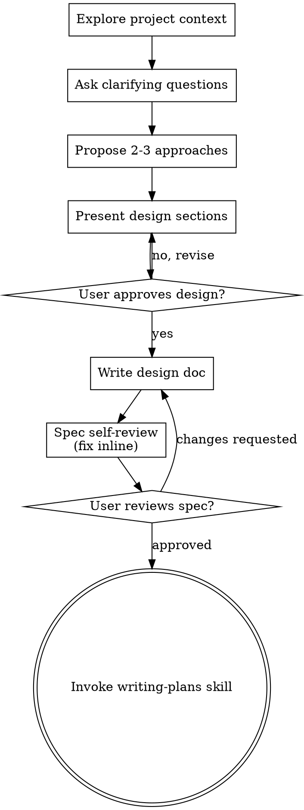

# 把想法头脑风暴成设计方案

通过自然的协作式对话，帮用户把想法打磨成完整成型的设计和 spec。

先摸清当前项目的上下文，然后一次问一个问题来逐步细化这个想法。等你搞清楚要构建的是什么了，把设计方案摆出来，让用户拍板。

<HARD-GATE>
在你拿出设计方案、并且用户点头之前,绝对不要调用任何实现类技能、不要写任何代码、不要搭建任何项目脚手架、也不要采取任何实现动作。这条规则适用于每一个项目,不管它看起来多简单。
</HARD-GATE>

## 反模式:"这也太简单了,根本不需要设计"

每个项目都要走这个流程。待办清单、单函数小工具、改个配置——统统都要。恰恰是"简单"项目里那些没被审视过的假设,最容易造成白干。设计可以写得很短(真正简单的项目几句话就行),但你必须把它摆出来并拿到批准。

## 检查清单

下面每一项你都必须建一个任务,并按顺序完成:

1. **摸清项目上下文** — 查看文件、文档、最近的提交
2. **在恰当时机提供视觉辅助工具** — 不要一上来就提。等到某个问题确实"给你看一眼"比"跟你描述"更清楚时,再提出来(单独发一条消息);用户同意后,它的浏览器标签页会为你打开。如果自始至终都没冒出需要视觉呈现的问题,那就永远别提。见下文的"视觉辅助工具"一节。
3. **提出澄清性问题** — 一次一个,搞清楚目的/约束/成功标准
4. **提出 2-3 种方案** — 附上取舍分析和你的推荐
5. **呈现设计** — 分成若干小节,每节篇幅按其复杂度伸缩,每呈现一节就征求一次用户批准
6. **写设计文档** — 保存到 `docs/superpowers/specs/YYYY-MM-DD-<topic>-design.md` 并提交
7. **spec 自查** — 快速就地检查有没有占位符、自相矛盾、含糊之处、范围问题(见下文)
8. **用户审阅写好的 spec** — 在继续之前,请用户审阅这份 spec 文件
9. **过渡到实现** — 调用 writing-plans 技能来制定实现计划

## 流程图

**终点状态是调用 writing-plans。** 不要调用 frontend-design、mcp-builder 或任何其他实现类技能。头脑风暴之后你唯一能调用的技能就是 writing-plans。

## 具体流程

**理解这个想法:**

- 先看看项目的当前状态(文件、文档、最近的提交)
- 在问细节问题之前,先评估范围:如果需求描述的是多个互相独立的子系统(比如"做一个带聊天、文件存储、计费和分析的平台"),立刻把这一点点出来。别把问题浪费在细抠一个本该先拆解的项目上。
- 如果项目太大、一份 spec 装不下,帮用户拆成若干子项目:哪些是独立的部分,它们之间什么关系,该按什么顺序构建?然后走正常的设计流程,先头脑风暴第一个子项目。每个子项目都有自己独立的 spec → plan → 实现 循环。
- 对于范围合适的项目,一次问一个问题来细化想法
- 尽量用选择题,不过开放式问题也没关系
- 每条消息只问一个问题——如果一个话题需要更多探讨,就把它拆成多个问题
- 聚焦于理解:目的、约束、成功标准

**探索方案:**

- 提出 2-3 种不同的方案,附带取舍
- 用对话的方式把选项摆出来,给出你的推荐和理由
- 先讲你推荐的那个,并解释为什么

**呈现设计:**

- 一旦你觉得自己搞懂了要构建什么,就把设计呈现出来
- 每一节的篇幅按复杂度伸缩:直白的几句话搞定,微妙的可以写到 200-300 字
- 每讲完一节,问一下到目前为止看着对不对
- 覆盖:架构、组件、数据流、错误处理、测试
- 如果有什么讲不通,随时准备回头澄清

**为隔离性和清晰度而设计:**

- 把系统拆成更小的单元,每个单元只有一个明确的职责,通过定义良好的接口通信,并且能够被独立地理解和测试
- 对每个单元,你都应该能回答:它做什么、怎么用、它依赖什么?
- 别人不读内部实现,能明白这个单元干嘛的吗?你能改内部实现而不搞坏调用方吗?如果不能,那边界就还需要打磨。
- 更小、边界更清晰的单元,你用起来也更顺手——你对能一次性装进上下文的代码推理得更好,文件聚焦时你的改动也更靠谱。当一个文件变得很大,那往往是个信号:它干的事太多了。

**在既有代码库里工作:**

- 在提出改动前,先探索现有结构。沿用既有模式。
- 如果现有代码存在影响本次工作的问题(比如某个文件变得太大、边界不清、职责纠缠在一起),就把有针对性的改进作为设计的一部分——就像一个好开发者会顺手改进自己正在动的代码那样。
- 别提无关的重构。守住当下目标,别跑题。

## 设计完成之后

**文档:**

- 把验证过的设计(spec)写到 `docs/superpowers/specs/YYYY-MM-DD-<topic>-design.md`
  - (如果用户对 spec 存放位置有偏好,以用户的偏好为准)
- 如果有 elements-of-style:writing-clearly-and-concisely 技能,就用上
- 把设计文档提交到 git

**spec 自查:**
写完 spec 文档后,用全新的眼光重新看一遍:

1. **占位符扫描:** 有没有 "TBD"、"TODO"、没写完的小节,或者含糊的需求?修掉。
2. **内部一致性:** 有没有哪些小节互相矛盾?架构和功能描述对得上吗?
3. **范围检查:** 它是否聚焦到足以对应单份实现计划,还是需要拆解?
4. **歧义检查:** 有没有哪条需求能被解读成两种意思?如果有,选定一种并写明白。

有问题就地修掉。不用再审一遍——修完接着往下走就行。

**用户审阅关卡:**
spec 审查循环通过后,在继续之前请用户审阅写好的 spec:

> "spec 已写好并提交到 `<path>`。请你审阅一下,在我们开始写实现计划之前,告诉我有没有想改的地方。"

等用户回复。如果他们要求改动,改完再跑一遍 spec 审查循环。只有用户点头了才继续。

**实现:**

- 调用 writing-plans 技能来制定详细的实现计划
- 不要调用任何其他技能。writing-plans 就是下一步。

## 关键原则

- **一次一个问题** - 别用一堆问题把人淹了
- **优先选择题** - 能选就选,比开放式问题好答
- **无情地践行 YAGNI** - 把所有设计里不必要的功能都砍掉
- **探索备选方案** - 定案前永远先提 2-3 种方案
- **增量验证** - 呈现设计、拿到批准,再往下走
- **保持灵活** - 有什么讲不通就回头澄清

## 视觉辅助工具

一个基于浏览器的辅助工具,用于在头脑风暴时展示原型图、示意图和视觉选项。它是一个工具,不是一种模式。接受这个工具意味着:遇到适合视觉呈现的问题时它随时可用;但绝不意味着每个问题都要走浏览器。

**提供这个工具(恰当时机):** 不要一上来就提。等到某个问题确实"给你看一眼"比"跟你说"更清楚时——一个真正需要原型图 / 布局 / 示意图的问题,而不仅仅是个 UI *话题*——第一次遇到这种情况,就在那时提出来,单独发一条消息:

> "接下来这部分我给你看一眼可能更好懂——我可以边聊边在浏览器标签页里做原型图、示意图和对比。这功能还比较新,而且比较费 token。要不要试试?我来帮你打开。"

**这条提议必须单独成一条消息。** 只放提议——不夹带澄清问题、总结或其他内容。等用户回复。如果他们同意,用 `--open` 启动服务,这样他们的浏览器会自动打开到第一屏。如果他们拒绝,就继续纯文本模式,除非他们自己再提起,否则别再提。

**逐题决策:** 即便用户已经同意,也要针对每一个问题分别决定:用浏览器还是用终端。判断标准:**用户是"看到它"比"读到它"更容易理解吗?**

- **用浏览器**呈现本身就是视觉性的内容——原型图、线框图、布局对比、架构示意图、并排的视觉设计
- **用终端**呈现文字性内容——需求类问题、概念性选择、取舍清单、A/B/C/D 文字选项、范围决策

一个关于 UI 话题的问题,并不自动就是视觉问题。"在这个语境里 personality 是什么意思?"是概念性问题——用终端。"哪种向导布局更好?"是视觉问题——用浏览器。

如果他们同意用这个工具,在继续之前先读一遍详细指南:
`skills/brainstorming/visual-companion.md`
