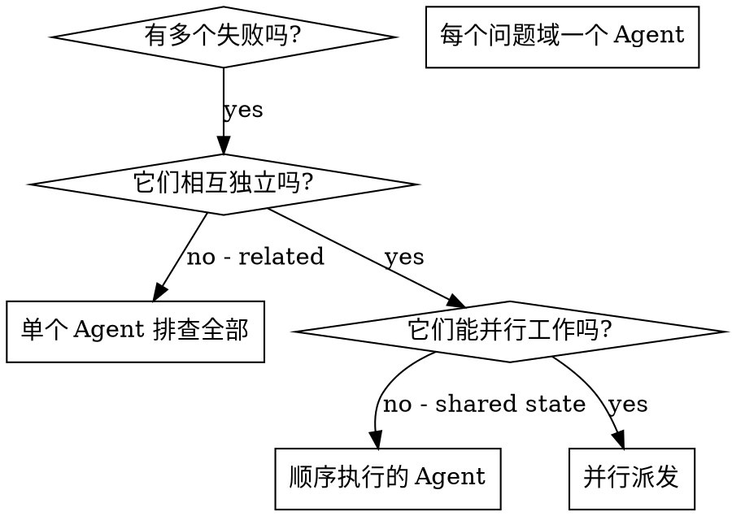

# 派发并行 Agent

## 概述

你把任务委派给拥有独立上下文的专职 Agent。通过精心设计它们的指令和上下文，你能确保它们专注并顺利完成任务。它们绝不应该继承你当前会话的上下文或历史——你要为它们精确地准备好所需的一切。这样做也能为你自己保留出用来做协调工作的上下文。

当你遇到多个互不相关的失败(不同的测试文件、不同的子系统、不同的 bug)时,一个一个地排查会浪费时间。每一项排查都是独立的,完全可以并行进行。

**核心原则:** 每一个独立的问题域派一个 Agent。让它们并发工作。

## 何时使用



**适合使用的场景:**
- 3 个或更多测试文件因为不同的根因而失败
- 多个子系统各自独立地坏掉了
- 每个问题都能脱离其他问题的上下文单独理解
- 各项排查之间不共享状态

**不要使用的场景:**
- 这些失败是相关的(修好一个可能会顺带修好其他)
- 需要理解整个系统的完整状态
- Agent 之间会相互干扰

## 具体做法

### 1. 识别独立的问题域

按"坏在哪儿"给失败分组:
- 文件 A 的测试:工具审批流程
- 文件 B 的测试:批量完成行为
- 文件 C 的测试:中止功能

每个问题域都是独立的——修工具审批不会影响中止相关的测试。

### 2. 创建聚焦的 Agent 任务

每个 Agent 都要拿到:
- **明确的范围:** 一个测试文件或一个子系统
- **清晰的目标:** 让这些测试通过
- **约束条件:** 不要改动其他代码
- **期望的产出:** 一份总结,说明你发现了什么、修了什么

### 3. 并行派发

在同一条回复里发出全部三个子 Agent 的派发指令——它们会并行运行:

```text
Subagent (general-purpose): "Fix agent-tool-abort.test.ts failures"
Subagent (general-purpose): "Fix batch-completion-behavior.test.ts failures"
Subagent (general-purpose): "Fix tool-approval-race-conditions.test.ts failures"
# All three run concurrently.
```

一条回复里发出多个派发调用 = 并行执行。一条回复一个 = 顺序执行。

### 4. 审查并整合

当 Agent 返回时:
- 阅读每一份总结
- 确认各处修复不冲突
- 运行完整的测试套件
- 整合所有改动

## Agent 提示词的结构

好的 Agent 提示词具备:
1. **聚焦** - 一个清晰的问题域
2. **自包含** - 包含理解问题所需的全部上下文
3. **对产出有明确要求** - Agent 应该返回什么?

```markdown
Fix the 3 failing tests in src/agents/agent-tool-abort.test.ts:

1. "should abort tool with partial output capture" - expects 'interrupted at' in message
2. "should handle mixed completed and aborted tools" - fast tool aborted instead of completed
3. "should properly track pendingToolCount" - expects 3 results but gets 0

These are timing/race condition issues. Your task:

1. Read the test file and understand what each test verifies
2. Identify root cause - timing issues or actual bugs?
3. Fix by:
   - Replacing arbitrary timeouts with event-based waiting
   - Fixing bugs in abort implementation if found
   - Adjusting test expectations if testing changed behavior

Do NOT just increase timeouts - find the real issue.

Return: Summary of what you found and what you fixed.
```

## 常见错误

**❌ 太宽泛:** "把所有测试都修好"——Agent 会迷失方向
**✅ 具体:** "修 agent-tool-abort.test.ts"——范围聚焦

**❌ 没有上下文:** "修一下竞态条件"——Agent 不知道在哪儿
**✅ 有上下文:** 把错误信息和测试名贴出来

**❌ 没有约束:** Agent 可能把所有东西都重构一遍
**✅ 有约束:** "不要改动生产代码"或"只修测试"

**❌ 产出含糊:** "把它修好"——你不知道改了什么
**✅ 具体:** "返回根因和改动的总结"

## 何时不要使用

**相关的失败:** 修一个可能会顺带修好其他的——先一起排查
**需要完整上下文:** 只有看到整个系统才能理解
**探索式调试:** 你还不知道哪里坏了
**共享状态:** Agent 会相互干扰(编辑同一批文件、使用同一批资源)

## 来自真实会话的例子

**场景:** 一次大规模重构之后,3 个文件里出现 6 个测试失败

**失败:**
- agent-tool-abort.test.ts:3 个失败(时序问题)
- batch-completion-behavior.test.ts:2 个失败(工具没有执行)
- tool-approval-race-conditions.test.ts:1 个失败(执行次数 = 0)

**决策:** 这些是独立的问题域——中止逻辑、批量完成、竞态条件三者互不相干

**派发:**
```
Agent 1 → Fix agent-tool-abort.test.ts
Agent 2 → Fix batch-completion-behavior.test.ts
Agent 3 → Fix tool-approval-race-conditions.test.ts
```

**结果:**
- Agent 1:用基于事件的等待替换掉超时
- Agent 2:修复了事件结构的 bug(threadId 放错了位置)
- Agent 3:加上了对异步工具执行完成的等待

**整合:** 所有修复相互独立,没有冲突,完整套件全绿

**节省的时间:** 3 个问题并行解决,而不是一个接一个

## 关键收益

1. **并行化** - 多项排查同时进行
2. **聚焦** - 每个 Agent 范围狭窄,需要跟踪的上下文更少
3. **独立性** - Agent 之间互不干扰
4. **速度** - 用解决 1 个问题的时间解决 3 个

## 验证

Agent 返回之后:
1. **审查每一份总结** - 弄清改了什么
2. **检查有无冲突** - Agent 是否编辑了同一段代码?
3. **运行完整套件** - 确认所有修复能协同工作
4. **抽查** - Agent 可能会犯系统性的错误

## 真实世界的影响

来自一次调试会话(2025-10-03):
- 3 个文件里 6 个失败
- 并行派发了 3 个 Agent
- 所有排查并发完成
- 所有修复成功整合
- Agent 改动之间零冲突
