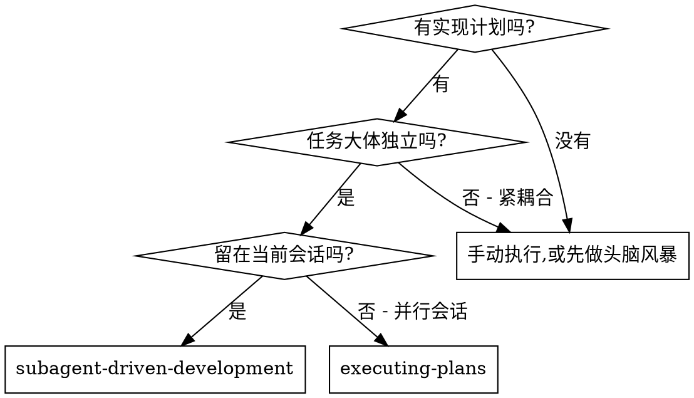
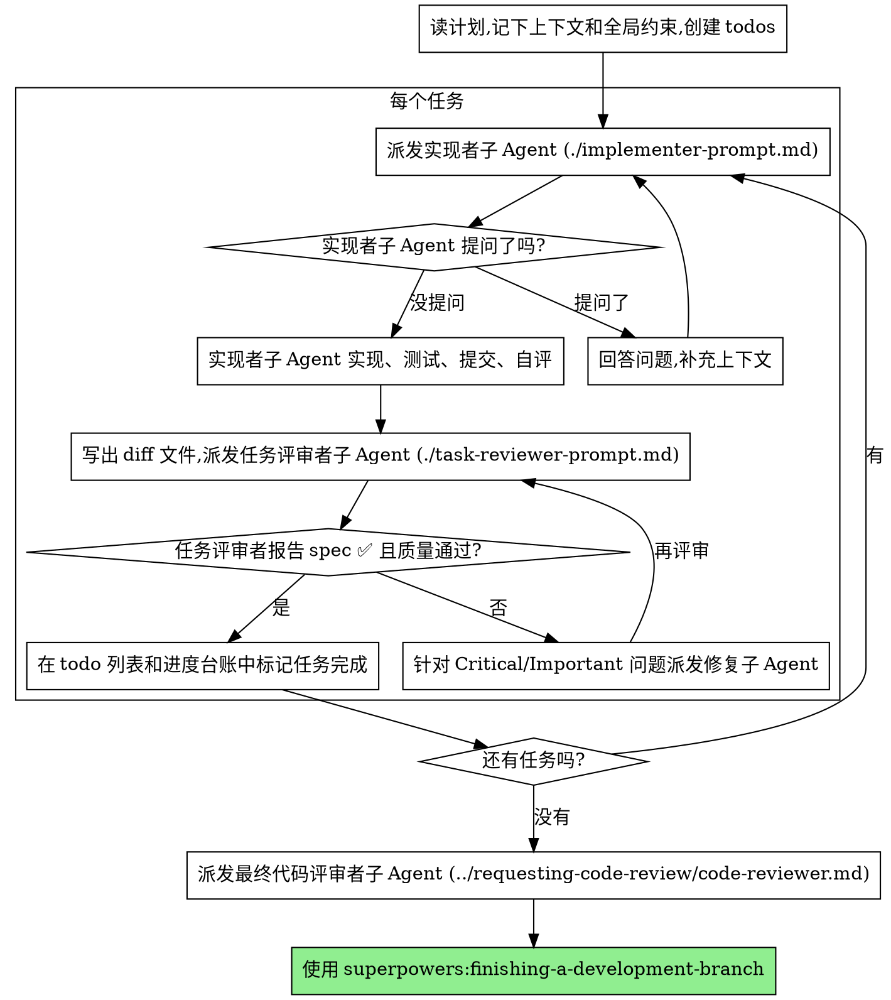

# 子 Agent 驱动开发（Subagent-Driven Development）

执行计划的方式是：每个任务派发一个全新的实现者子 Agent，每个任务完成后做一次任务级评审（是否符合 spec + 代码质量），最后再做一次面向整条分支的全局评审。

**为什么用子 Agent：**你把任务委托给拥有隔离上下文的专职 Agent。通过精心设计它们的指令和上下文，你确保它们始终聚焦并顺利完成任务。它们绝不应该继承你会话里的上下文或历史——你要精确地为它们构造它们所需的一切。这样也能把你自己的上下文留给协调工作。

**核心原则:**每个任务派发全新子 Agent + 任务级评审(spec + 质量) + 最后一次全局评审 = 高质量、快迭代

**旁白(Narration):**在工具调用之间,最多说一行简短的旁白——记录都在进度台账(ledger)和工具返回结果里。

**持续执行:**任务之间不要停下来找你的人类搭档确认。把计划里的所有任务一口气执行完,别停。只有以下几种情况才停:遇到你自己解决不了的 BLOCKED 状态、真的会阻碍推进的歧义、或者所有任务都完成了。"我要继续吗?"这类询问和进度汇报是在浪费他们的时间——他们让你执行计划,那就执行。

## 何时使用



**对比 Executing Plans(并行会话):**
- 同一个会话(不切换上下文)
- 每个任务派发全新子 Agent(不污染上下文)
- 每个任务后评审(是否符合 spec + 代码质量),最后做全局评审
- 迭代更快(任务之间没有人工介入环节)

## 整个流程



## 起飞前的计划审查(Pre-Flight Plan Review)

在派发 Task 1 之前,先把整个计划扫一遍,找出冲突:

- 相互矛盾的任务,或与计划的 Global Constraints(全局约束)矛盾的任务
- 计划明确要求、但评审标准会判定为缺陷的东西(比如一个什么都没断言的测试、逐字重复的逻辑块)

把你发现的所有问题打包成一个问题,一次性抛给你的人类搭档——每条发现都紧挨着"要求它这么做"的计划原文,问哪一个说了算——在开始执行之前问,而不是执行到一半每发现一个就打断一次。如果扫描下来干干净净,那就直接推进,别多说。评审循环仍然是那张网,兜住那些只有在实现过程中才浮现出来的冲突。

## 模型选择(Model Selection)

在每个角色能胜任的前提下,用最弱的模型,以节省成本、提升速度。

**机械性的实现任务**(孤立的函数、清晰的 spec、1-2 个文件):用快而便宜的模型。当计划写得足够清楚时,大多数实现任务都是机械性的。

**集成与判断类任务**(多文件协调、模式匹配、调试):用标准模型。

**架构与设计类任务**:用现有最强的模型。
最后那次面向整条分支的全局评审就属于这一类——用现有最强的模型来派发它,而不是会话默认的模型。

**评审任务**:选用同等判断力的模型,按 diff 的体量、复杂度和风险来缩放。一个小的机械性 diff 不需要最强的模型;一处微妙的并发改动则需要。

**派发子 Agent 时永远显式指定模型。**省略模型会继承你会话的模型——往往是最强也最贵的那个——这会悄无声息地让本节的努力全部失效。

**轮次数(turn count)比 token 单价更重要。**墙上时钟耗时和上下文成本随子 Agent 花的轮次数增长,而最便宜的模型在多步工作上动不动就要多花 2-3 倍的轮次——总账算下来反而更贵。给评审者、以及依据散文描述工作的实现者,把中档模型作为下限。当任务的计划正文里已经包含要写的完整代码时,实现就是"抄写 + 测试":这种实现者用最便宜的档位。单文件的机械性修复也用最便宜的档位。

**任务复杂度信号(实现任务):**
- 触及 1-2 个文件且 spec 完整 → 便宜模型
- 触及多个文件且涉及集成问题 → 标准模型
- 需要设计判断或对代码库有广泛理解 → 最强模型

## 处理实现者的状态

实现者子 Agent 会报告四种状态之一。分别妥善处理:

**DONE:**生成评审包(`scripts/review-package BASE HEAD`,在本技能目录下运行——它会打印它写出的那个唯一文件路径;BASE 是你在派发实现者之前记录下的那个提交——绝不要用 `HEAD~1`,那会悄无声息地丢掉一个多提交任务里除最后一个之外的所有提交),然后用打印出的路径派发任务评审者。

**DONE_WITH_CONCERNS:**实现者完成了工作,但提出了疑虑。在继续之前先读这些疑虑。如果疑虑关乎正确性或范围,先处理掉再评审。如果只是些观察(比如"这个文件越来越大了"),记下来然后照常进入评审。

**NEEDS_CONTEXT:**实现者需要没提供给它的信息。补上缺失的上下文,重新派发。

**BLOCKED:**实现者无法完成任务。评估这个阻塞点:
1. 如果是上下文问题,补充更多上下文,用同一个模型重新派发
2. 如果任务需要更多推理,换更强的模型重新派发
3. 如果任务太大,拆成更小的块
4. 如果是计划本身有问题,上报给人类

**永远不要**忽略一次上报,也不要在什么都不改的情况下逼同一个模型重试。如果实现者说它卡住了,那就得有东西变一变。

## 处理评审者的 ⚠️ 条目

任务评审者可能报告 "⚠️ Cannot verify from diff"(无法从 diff 验证)的条目——那些落在未改动代码里、或者跨多个任务的需求。这些不会阻塞评审的其余部分,但你必须在标记任务完成之前自己逐一解决:你手里有评审者没有的计划和跨任务上下文。如果你确认某一条确实是真实的缺口,就把它当作一次未通过的 spec 评审来处理——退回给实现者,然后重新评审。

## 构造评审者提示词(Constructing Reviewer Prompts)

每个任务的评审是任务范围内的关卡。广度性的评审只发生一次,即最后那次面向整条分支的全局评审。当你填写评审者模板时:

- 不要在没有具体的、针对该任务的理由的情况下,加"检查所有用法"或"有必要就跑竞态测试"这类开放式指令
- 不要让评审者去重跑实现者已经在同一份代码上跑过的测试——实现者的报告里带着测试证据
- 不要替评审者预判发现——绝不要指示评审者忽略或不要标记某个具体问题。如果你觉得某条发现会是误报,那就让评审者提出来,在评审循环里裁定。如果你正在写的提示词里出现了 "do not flag"(别标记)、"don't treat X as a defect"(别把 X 当缺陷)、"at most Minor"(顶多算 Minor)、"the plan chose"(计划选了这样)——停下:你在预判,而且通常是为了给自己省一个评审循环。
- 你交给评审者的全局约束块,就是它的注意力透镜。从计划的 Global Constraints 章节或 spec 里逐字照抄那些有约束力的要求:精确的取值、精确的格式、以及组件之间被明确规定的关系("与 X 相同的布局"、"和 Y 匹配")。评审者的模板里已经带着流程规则(YAGNI、测试卫生、评审方法)——约束块是用来放**这个**项目的 spec 所要求的内容的。
- 把 diff 作为文件交给评审者:运行本技能的 `scripts/review-package BASE HEAD`,把它打印出的文件路径传给评审者(或者,没有 bash 时:对该区间执行 `git log --oneline`、`git diff --stat`、`git diff -U10`,把输出重定向到一个唯一命名的文件)。这些输出永远不会进入你自己的上下文,而评审者一次 Read 调用就能看到提交列表、stat 摘要,以及带上下文的完整 diff。用你在派发实现者之前记录下的那个 BASE——绝不要用 `HEAD~1`,那会悄无声息地把多提交任务截断。
- 一条派发提示词描述的是一个任务,不是这个会话的历史。不要把累积的前序任务摘要("Task 1-3 之后的状态")粘贴进后面的派发里——某次真实会话的派发达到了 42k 字符,其中 99% 是粘贴进去的历史。一个全新的子 Agent 需要的是它的任务、它要触及的接口,以及全局约束。别的都不要。
- 针对 Critical 和 Important 的发现派发修复子 Agent。随手把 Minor 发现记进进度台账,并让最后那次全局评审指向那份清单,以便它分诊出哪些必须在合并前修掉。一份没人读的汇总等于悄悄丢弃。
- 一条被标为"计划要求(plan-mandated)"的发现——或任何与计划正文所要求内容相冲突的发现——都由人类来决定,和任何计划矛盾一样:把这条发现和计划原文摆出来,问哪一个说了算。不要因为计划要求了就驳回这条发现,也不要在没问的情况下派发一个与计划相冲突的修复。
- 最后那次面向整条分支的全局评审也要拿到一个评审包:运行 `scripts/review-package MERGE_BASE HEAD`(MERGE_BASE = 分支起点那个提交,比如 `git merge-base main HEAD`),把打印出的路径放进最终评审的派发里,这样最终评审者读的是一个文件,而不是用 git 命令重新推导整条分支的 diff。
- 每一次修复派发都带着实现者契约:修复子 Agent 重跑覆盖它这次改动的测试,并报告结果。在派发里点名那些覆盖性的测试文件——一行的修复不需要跑整个测试套件。在重新派发评审者之前,确认修复报告里含有那些覆盖性测试、跑的命令,以及输出;三者都齐了再派发重新评审。
- 如果最后那次全局评审返回了一堆发现,只派发一个修复子 Agent,带上完整的发现清单——不要每条发现派一个修复者。逐条发现的修复者各自重建上下文、重跑套件;某次真实会话的最终评审修复潮花的钱比它所有任务加起来还多。

## 文件交接(File Handoffs)

你粘贴进派发提示词的一切——以及子 Agent 打印回来的一切——都会在会话余下的时间里常驻你的上下文,并在之后每一轮里被重新读取。把产物作为文件来交接:

- **任务简报(Task brief):**在派发实现者之前,运行本技能的 `scripts/task-brief PLAN_FILE N`——它会把该任务的完整正文抽取到一个唯一命名的文件,并打印路径。这样组织你的派发,让简报保持为需求的唯一来源。你的派发应当包含:(1) 一句话说明这个任务在项目里的位置;(2) 简报路径,以"先读这个——它是你的需求,里面有要逐字使用的精确取值"这样的话引出;(3) 简报无从得知的、来自前序任务的接口和决策;(4) 你对简报里注意到的任何歧义的裁定;(5) 报告文件路径和报告契约。精确取值(数字、魔法字符串、签名、测试用例)只出现在简报里。
- **报告文件(Report file):**实现者的报告文件按简报来命名(简报 `…/task-N-brief.md` → 报告 `…/task-N-report.md`),并把它放进派发提示词。实现者把完整报告写在那里,只返回状态、提交、一行测试摘要,以及疑虑。
- **评审者输入(Reviewer inputs):**任务评审者拿到三个路径——同一个简报文件、报告文件、评审包——外加约束该任务的全局约束。
- 修复派发把它们的修复报告(带测试结果)追加到同一个报告文件,并返回一段简短摘要;重新评审读那个更新后的文件。

## 持久化进度(Durable Progress)

对话记忆熬不过压缩(compaction)。在真实会话里,丢失了自己位置的控制者曾把整段已完成的任务序列又重新派发了一遍——这是观察到的最昂贵的失败。把进度追踪在一个台账文件里,而不只是在 todos 里。

- 技能开始时,检查是否有台账:`cat "$(git rev-parse --show-toplevel)/.superpowers/sdd/progress.md"`。在那里被列为完成的任务就是 DONE——不要重新派发它们;从第一个未标记完成的任务恢复。
- 当一个任务的评审干净地返回时,在你做其他记账的同一条消息里,往台账追加一行:`Task N: complete (commits <base7>..<head7>, review clean)`。
- 台账是你的恢复地图:它点名的那些提交存在于 git 里,哪怕你的上下文已经不记得创建过它们。压缩之后,相信台账和 `git log`,别信你自己的记忆。
- `git clean -fdx` 会毁掉台账(它是被 git 忽略的临时文件);如果真发生了,从 `git log` 恢复。

## 提示词模板(Prompt Templates)

- [implementer-prompt.md](implementer-prompt.md) - 派发实现者子 Agent
- [task-reviewer-prompt.md](task-reviewer-prompt.md) - 派发任务评审者子 Agent(是否符合 spec + 代码质量)
- 最后那次面向整条分支的全局评审:使用 superpowers:requesting-code-review 的 [code-reviewer.md](../requesting-code-review/code-reviewer.md)

## 工作流示例

```
你:我在用 Subagent-Driven Development 来执行这个计划。

[把计划文件读一遍:docs/superpowers/plans/feature-plan.md]
[为所有任务创建 todos]

Task 1:Hook 安装脚本

[对 Task 1 运行 task-brief;派发实现者,带上简报 + 报告路径 + 上下文]

实现者:"开始之前——这个 hook 该装在用户级还是系统级?"

你:"用户级(~/.config/superpowers/hooks/)"

实现者:"明白。现在开始实现……"
[稍后] 实现者:
  - 实现了 install-hook 命令
  - 加了测试,5/5 通过
  - 自评:发现我漏了 --force 标志,补上了
  - 已提交

[运行 review-package,用打印出的路径派发任务评审者]
任务评审者:Spec ✅ - 所有需求满足,没有多余的东西。
  优点:测试覆盖好,干净。问题:无。任务质量:通过。

[标记 Task 1 完成]

Task 2:恢复模式

[对 Task 2 运行 task-brief;派发实现者,带上简报 + 报告路径 + 上下文]

实现者:[没问题,直接开始]
实现者:
  - 加了 verify/repair 模式
  - 8/8 测试通过
  - 自评:一切正常
  - 已提交

[运行 review-package,用打印出的路径派发任务评审者]
任务评审者:Spec ❌:
  - 缺失:进度报告(spec 说"每 100 项报告一次")
  - 多余:加了 --json 标志(没要求)
  问题(Important):魔法数字(100)

[派发修复子 Agent,带上所有发现]
修复者:移除了 --json 标志,加了进度报告,抽出了 PROGRESS_INTERVAL 常量

[任务评审者再次评审]
任务评审者:Spec ✅。任务质量:通过。

[标记 Task 2 完成]

...

[所有任务完成后]
[派发最终 code-reviewer]
最终评审者:所有需求满足,可以合并

搞定!
```

## 优势

**对比手动执行:**
- 子 Agent 天然遵循 TDD
- 每个任务有全新上下文(不会混淆)
- 并行安全(子 Agent 之间不互相干扰)
- 子 Agent 可以提问(工作前**和**工作中都能问)

**对比 Executing Plans:**
- 同一个会话(没有交接)
- 持续推进(不用等)
- 评审检查点自动进行

**效率收益:**
- 控制者精确策划需要哪些上下文;大块产物作为文件流转,不粘贴文本
- 子 Agent 一开始就拿到完整信息
- 问题在工作开始前就浮现出来(而不是之后)

**质量关卡:**
- 自评在交接前就抓出问题
- 任务评审带两个裁决:是否符合 spec 和代码质量
- 评审循环确保修复真的管用
- 是否符合 spec 防止过度/不足建设
- 代码质量确保实现造得好

**成本:**
- 更多子 Agent 调用(每个任务一个实现者 + 一个评审者)
- 控制者做更多准备工作(一开始就抽出所有任务)
- 评审循环增加了迭代次数
- 但能尽早抓出问题(比之后调试更便宜)

## 危险信号(Red Flags)

**永远不要:**
- 在没有用户明确同意的情况下,就在 main/master 分支上开始实现
- 跳过任务评审,或接受一份缺了任一裁决的报告(是否符合 spec **和**任务质量两者都必需)
- 带着没修的问题往下走
- 并行派发多个实现子 Agent(会冲突)
- 让子 Agent 去读整个计划文件(把它的任务简报交给它——用 `scripts/task-brief`——来替代)
- 跳过场景铺垫的上下文(子 Agent 需要理解任务处在哪里)
- 忽略子 Agent 的提问(在让它们继续之前先回答)
- 在是否符合 spec 上接受"差不多就行"(评审者发现了 spec 问题 = 没完成)
- 跳过评审循环(评审者发现问题 = 实现者修 = 再评审一次)
- 让实现者的自评取代真正的评审(两者都需要)
- 告诉评审者什么不要标记,或在派发提示词里给一条发现预设严重度("顶多当 Minor 处理")——计划里的示例代码是起点,不是"它的弱点是被有意选择的"的证据
- 在没有 diff 文件的情况下派发任务评审者——先生成它(`scripts/review-package BASE HEAD`),并在提示词里点名打印出的路径
- 在评审还有未解决的 Critical/Important 问题时就转向下一个任务
- 重新派发进度台账已标记完成的任务——在任何压缩或恢复之后,检查台账(和 `git log`)

**如果子 Agent 提问:**
- 清晰、完整地回答
- 需要就补充更多上下文
- 别催着它们赶紧去实现

**如果评审者发现问题:**
- 由实现者(同一个子 Agent)来修
- 评审者再评审一次
- 重复直到通过
- 别跳过重新评审

**如果子 Agent 没完成任务:**
- 派发修复子 Agent,给它具体指令
- 别自己手动修(会污染上下文)

## 集成(Integration)

**必需的工作流技能:**
- **superpowers:using-git-worktrees** - 确保有隔离的工作区(创建一个或验证已有的)
- **superpowers:writing-plans** - 创建本技能要执行的那个计划
- **superpowers:requesting-code-review** - 为最后那次全局评审提供代码评审模板
- **superpowers:finishing-a-development-branch** - 所有任务完成后收尾开发

**子 Agent 应当使用:**
- **superpowers:test-driven-development** - 子 Agent 对每个任务遵循 TDD

**替代工作流:**
- **superpowers:executing-plans** - 用于并行会话,替代同会话执行
