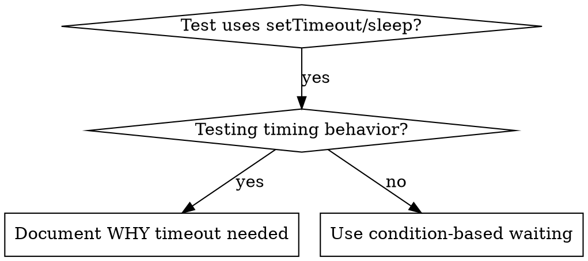

# 基于条件的等待

## 概述

不稳定的测试常常靠随意设定的延迟去猜时序。这会制造出竞态条件——测试在快机器上通过,一旦有负载或在 CI 里就挂掉。

**核心原则:** 去等你真正关心的那个条件,而不是猜它需要多久。

## 何时使用



**在以下情况使用:**
- 测试里有随意的延迟(`setTimeout`、`sleep`、`time.sleep()`)
- 测试不稳定(时而通过,一有负载就失败)
- 并行运行时测试超时
- 在等待异步操作完成

**不要在以下情况使用:**
- 在测试真实的时序行为(防抖、节流的时间间隔)
- 如果一定要用随意的超时,永远记得写明为什么

## 核心模式

```typescript
// ❌ BEFORE: Guessing at timing
await new Promise(r => setTimeout(r, 50));
const result = getResult();
expect(result).toBeDefined();

// ✅ AFTER: Waiting for condition
await waitFor(() => getResult() !== undefined);
const result = getResult();
expect(result).toBeDefined();
```

## 常用模式速查

| 场景 | 模式 |
|----------|---------|
| 等待事件 | `waitFor(() => events.find(e => e.type === 'DONE'))` |
| 等待状态 | `waitFor(() => machine.state === 'ready')` |
| 等待计数 | `waitFor(() => items.length >= 5)` |
| 等待文件 | `waitFor(() => fs.existsSync(path))` |
| 复合条件 | `waitFor(() => obj.ready && obj.value > 10)` |

## 实现

通用的轮询函数:
```typescript
async function waitFor<T>(
  condition: () => T | undefined | null | false,
  description: string,
  timeoutMs = 5000
): Promise<T> {
  const startTime = Date.now();

  while (true) {
    const result = condition();
    if (result) return result;

    if (Date.now() - startTime > timeoutMs) {
      throw new Error(`Timeout waiting for ${description} after ${timeoutMs}ms`);
    }

    await new Promise(r => setTimeout(r, 10)); // Poll every 10ms
  }
}
```

本目录下的 `condition-based-waiting-example.ts` 里有完整实现,包含来自真实调试会话、面向具体领域的辅助函数(`waitForEvent`、`waitForEventCount`、`waitForEventMatch`)。

## 常见错误

**❌ 轮询太快:** `setTimeout(check, 1)` —— 浪费 CPU
**✅ 修正:** 每 10ms 轮询一次

**❌ 没有超时:** 条件永不满足时会死循环
**✅ 修正:** 永远带上超时,并给出清晰的错误信息

**❌ 数据陈旧:** 在循环外缓存了状态
**✅ 修正:** 在循环内调用 getter 拿到新鲜数据

## 什么时候用随意超时才是对的

```typescript
// Tool ticks every 100ms - need 2 ticks to verify partial output
await waitForEvent(manager, 'TOOL_STARTED'); // First: wait for condition
await new Promise(r => setTimeout(r, 200));   // Then: wait for timed behavior
// 200ms = 2 ticks at 100ms intervals - documented and justified
```

**要求:**
1. 先等待触发条件
2. 基于已知的时序(不是瞎猜)
3. 写注释说明为什么

## 实战效果

来自调试会话(2025-10-03):
- 修好了跨 3 个文件的 15 个不稳定测试
- 通过率:60% → 100%
- 执行时间:快了 40%
- 再也没有竞态条件
