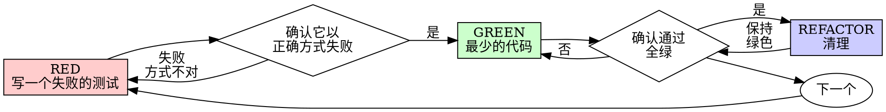

# 测试驱动开发(TDD)

## 概述

先写测试。看着它失败。再写最少的代码让它通过。

**核心原则:** 如果你没亲眼看着测试失败,你就无法确定它测的是不是对的东西。

**违背规则的字面含义,就是违背规则的精神。**

## 何时使用

**始终使用:**
- 新功能
- 修 bug
- 重构
- 行为变更

**例外(要问你的人类搭档):**
- 用完即弃的原型
- 生成的代码
- 配置文件

心里想着"就这一次跳过 TDD 吧"?停。这是在给自己找借口。

## 铁律

```
没有先写好一个失败的测试,就不准写生产代码
```

在测试之前就写了代码?删掉。重新来过。

**没有例外:**
- 别把它留着当"参考"
- 别在写测试时"照搬改造"它
- 别去看它
- 删就是删

从测试出发,重新实现。就这样。

## 红-绿-重构



### RED - 写一个失败的测试

写一个最小的测试,表明应该发生什么。

<Good>
```typescript
test('retries failed operations 3 times', async () => {
  let attempts = 0;
  const operation = () => {
    attempts++;
    if (attempts < 3) throw new Error('fail');
    return 'success';
  };

  const result = await retryOperation(operation);

  expect(result).toBe('success');
  expect(attempts).toBe(3);
});
```
名字清晰,测的是真实行为,只测一件事
</Good>

<Bad>
```typescript
test('retry works', async () => {
  const mock = jest.fn()
    .mockRejectedValueOnce(new Error())
    .mockRejectedValueOnce(new Error())
    .mockResolvedValueOnce('success');
  await retryOperation(mock);
  expect(mock).toHaveBeenCalledTimes(3);
});
```
名字含糊,测的是 mock 而不是代码
</Bad>

**要求:**
- 只测一个行为
- 名字清晰
- 用真实代码(除非实在避不开,否则别用 mock)

### 确认 RED - 看着它失败

**必须做。绝不跳过。**

```bash
npm test path/to/test.test.ts
```

确认:
- 测试是失败(而不是报错)
- 失败信息符合预期
- 失败原因是功能缺失(而不是拼写错误)

**测试通过了?** 说明你在测已有的行为。修正测试。

**测试报错了?** 修掉错误,重跑,直到它以正确方式失败。

### GREEN - 最少的代码

写最简单的代码让测试通过。

<Good>
```typescript
async function retryOperation<T>(fn: () => Promise<T>): Promise<T> {
  for (let i = 0; i < 3; i++) {
    try {
      return await fn();
    } catch (e) {
      if (i === 2) throw e;
    }
  }
  throw new Error('unreachable');
}
```
刚好够通过
</Good>

<Bad>
```typescript
async function retryOperation<T>(
  fn: () => Promise<T>,
  options?: {
    maxRetries?: number;
    backoff?: 'linear' | 'exponential';
    onRetry?: (attempt: number) => void;
  }
): Promise<T> {
  // YAGNI
}
```
过度设计
</Bad>

别加功能,别重构其他代码,也别做超出测试需要的"改进"。

### 确认 GREEN - 看着它通过

**必须做。**

```bash
npm test path/to/test.test.ts
```

确认:
- 测试通过
- 其他测试仍然通过
- 输出干干净净(没有错误、没有警告)

**测试失败?** 修代码,不是修测试。

**其他测试失败?** 现在就修。

### REFACTOR - 清理

只在绿灯之后做:
- 消除重复
- 改进命名
- 抽取辅助函数

保持测试全绿。别加新行为。

### 重复

为下一个功能写下一个失败的测试。

## 好的测试

| 特质 | 好 | 坏 |
|---------|------|-----|
| **最小** | 只测一件事。名字里有"and"?拆开它。 | `test('validates email and domain and whitespace')` |
| **清晰** | 名字描述行为 | `test('test1')` |
| **体现意图** | 展示你期望的 API | 让人看不清代码该做什么 |

## 为什么顺序很重要

**"我写完代码之后再写测试来验证它能用"**

代码之后写的测试会立刻通过。立刻通过什么都证明不了:
- 可能测错了东西
- 可能测的是实现,不是行为
- 可能漏掉了你没想到的边界情况
- 你从来没见过它抓住 bug

先写测试逼你亲眼看着测试失败,证明它确实在测某样东西。

**"这些边界情况我已经手动测过了"**

手动测试是随性的。你以为都测了,但是:
- 没有记录你测了什么
- 代码改了没法重跑
- 有压力时容易漏掉某些情况
- "我试的时候是好的"≠ 全面覆盖

自动化测试是系统性的。它们每次都以同样的方式运行。

**"删掉几个小时的工作太浪费了"**

沉没成本谬误。时间已经花掉了。你现在的选择是:
- 删掉并用 TDD 重写(再花 X 小时,高信心)
- 留着并事后补测试(30 分钟,低信心,大概率有 bug)

真正的"浪费"是留着你信不过的代码。没有真实测试的能跑的代码是技术债。

**"TDD 太教条了,务实意味着灵活变通"**

TDD 本身就很务实:
- 在提交前发现 bug(比事后调试快)
- 防止回归(测试能立刻抓住破坏)
- 记录行为(测试展示了如何使用代码)
- 让重构成为可能(随便改,测试会抓住破坏)

"务实"的走捷径 = 在生产环境里调试 = 更慢。

**"事后补测试也能达到同样目的——重在精神而非形式"**

不对。事后补的测试回答的是"这段代码做了什么?"先写的测试回答的是"这段代码应该做什么?"

事后补的测试会被你的实现带偏。你测的是你造出来的东西,而不是需求要求的东西。你验证的是你记得的边界情况,而不是发现的边界情况。

先写测试逼你在实现之前就去发现边界情况。事后补测试只是验证你什么都记得(其实你没记全)。

事后花 30 分钟写测试 ≠ TDD。你得到了覆盖率,却失去了"测试确实有效"的证明。

## 常见的自我合理化

| 借口 | 现实 |
|--------|---------|
| "太简单了不用测" | 简单代码也会坏。写测试只要 30 秒。 |
| "我事后再测" | 立刻通过的测试什么都证明不了。 |
| "事后补测试也能达到同样目的" | 事后测 = "这段代码做了什么?" 先写测 = "这段代码应该做什么?" |
| "已经手动测过了" | 随性 ≠ 系统性。没记录,没法重跑。 |
| "删掉 X 小时的工作太浪费" | 沉没成本谬误。留着未验证的代码就是技术债。 |
| "留着当参考,先写测试" | 你会去照搬它。那就是事后测。删就是删。 |
| "得先探索一下" | 可以。探索完扔掉,从 TDD 重新开始。 |
| "难测 = 设计不清晰" | 听测试的话。难测 = 难用。 |
| "TDD 会拖慢我" | TDD 比调试快。务实 = 先写测试。 |
| "手动测更快" | 手动测证明不了边界情况。每次改动你都得重测。 |
| "现有代码没有测试" | 你正在改进它。为现有代码补上测试。 |

## 危险信号——停,重新开始

- 先写了代码才写测试
- 实现之后才补测试
- 测试立刻就通过了
- 说不清测试为什么失败
- 测试"以后再加"
- 给自己找借口"就这一次"
- "我已经手动测过了"
- "事后补测试也能达到同样目的"
- "重在精神而非形式"
- "留着当参考" 或 "照搬现有代码"
- "已经花了 X 小时,删掉太浪费"
- "TDD 太教条,我是在务实"
- "这次不一样,因为……"

**上面这些全都意味着:删掉代码。用 TDD 重新开始。**

## 示例:修 bug

**bug:** 空邮箱被接受了

**RED**
```typescript
test('rejects empty email', async () => {
  const result = await submitForm({ email: '' });
  expect(result.error).toBe('Email required');
});
```

**确认 RED**
```bash
$ npm test
FAIL: expected 'Email required', got undefined
```

**GREEN**
```typescript
function submitForm(data: FormData) {
  if (!data.email?.trim()) {
    return { error: 'Email required' };
  }
  // ...
}
```

**确认 GREEN**
```bash
$ npm test
PASS
```

**REFACTOR**
如果需要,把校验逻辑抽出来给多个字段复用。

## 验收清单

在宣布工作完成之前:

- [ ] 每个新的函数/方法都有测试
- [ ] 实现之前亲眼看着每个测试失败
- [ ] 每个测试都是因为预期的原因失败(功能缺失,而不是拼写错误)
- [ ] 写了最少的代码让每个测试通过
- [ ] 所有测试通过
- [ ] 输出干干净净(没有错误、没有警告)
- [ ] 测试使用真实代码(除非避不开才用 mock)
- [ ] 覆盖了边界情况和错误

没法把所有框都打勾?说明你跳过了 TDD。重新开始。

## 卡住时

| 问题 | 解决办法 |
|---------|----------|
| 不知道怎么测 | 写出你想要的 API。先写断言。问你的人类搭档。 |
| 测试太复杂 | 设计太复杂。简化接口。 |
| 什么都得 mock | 代码耦合太重。用依赖注入。 |
| 测试的准备工作巨大 | 抽取辅助函数。还是复杂?简化设计。 |

## 与调试的结合

发现 bug?写一个能复现它的失败测试。按 TDD 循环走。测试既证明了修复,又防止回归。

绝不在没有测试的情况下修 bug。

## 测试反模式

在添加 mock 或测试工具时,阅读 [testing-anti-patterns.md](testing-anti-patterns.md) 来避开常见的坑:
- 测的是 mock 的行为而不是真实行为
- 给生产类加只在测试里用的方法
- 在不理解依赖关系的情况下就 mock

## 最终规则

```
生产代码 → 存在测试,且先失败过
否则 → 不是 TDD
```

未经你的人类搭档许可,没有例外。
