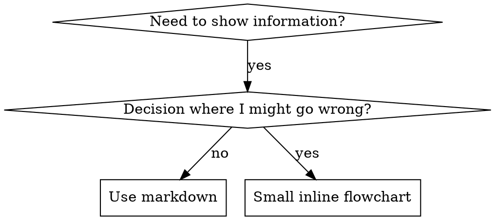

# 编写技能

## 概述

**编写技能,本质就是把测试驱动开发(TDD)用在流程文档上。**

**个人技能存放在你运行时的 skills 目录里**

你先写测试用例(用子 Agent 做压力场景),看着它们失败(基线行为),写出技能(文档),看着测试通过(Agent 遵守),再重构(堵住漏洞)。

**核心原则:** 如果你没有亲眼看过 Agent 在没有该技能时失败,你就不知道这个技能教的是不是对的东西。

**REQUIRED BACKGROUND:** 使用本技能前,你必须先理解 superpowers:test-driven-development。那个技能定义了根本的 RED-GREEN-REFACTOR 循环。本技能是把 TDD 改造用到文档上。

**官方指引:** Anthropic 官方的技能编写最佳实践见 anthropic-best-practices.md。那份文档提供了额外的模式和准则,是对本技能中以 TDD 为核心的方法的补充。

## 什么是技能?

一个**技能(skill)**是一份关于经过验证的技巧、模式或工具的参考指南。技能帮助未来的 Agent 找到并应用行之有效的做法。

**技能是:** 可复用的技巧、模式、工具、参考指南

**技能不是:** 关于你某一次是怎么解决某个问题的叙事

## 技能创建的 TDD 对应关系

| TDD 概念 | 技能创建 |
|-------------|----------------|
| **测试用例** | 用子 Agent 做的压力场景 |
| **生产代码** | 技能文档(SKILL.md) |
| **测试失败(RED)** | Agent 在没有技能时违反规则(基线) |
| **测试通过(GREEN)** | 有技能在场时 Agent 遵守 |
| **重构** | 在保持遵守的同时堵住漏洞 |
| **先写测试** | 在写技能之前先跑基线场景 |
| **看着它失败** | 记录 Agent 用的确切说辞 |
| **最小代码** | 写出针对这些具体违规的技能 |
| **看着它通过** | 验证 Agent 现在遵守了 |
| **重构循环** | 发现新说辞 → 堵上 → 重新验证 |

整个技能创建过程都遵循 RED-GREEN-REFACTOR。

## 何时该创建技能

**在以下情况创建:**
- 这个技巧对你来说并非一目了然
- 你会跨项目再次引用它
- 这个模式适用范围广(不是项目专属)
- 别人也会从中受益

**不要为以下情况创建:**
- 一次性的解决方案
- 别处已有充分文档的标准做法
- 项目专属的约定(放进你的指令文件里)
- 机械性约束(如果能用正则/校验来强制执行,就自动化它——把文档留给需要判断的场合)

## 技能类型

### 技巧(Technique)
有具体步骤可循的方法(condition-based-waiting、root-cause-tracing)

### 模式(Pattern)
思考问题的方式(flatten-with-flags、test-invariants)

### 参考(Reference)
API 文档、语法指南、工具文档(office docs)

## 目录结构


```
skills/
  skill-name/
    SKILL.md              # Main reference (required)
    supporting-file.*     # Only if needed
```

**扁平命名空间** - 所有技能处在同一个可搜索的命名空间里

**在以下情况单独建文件:**
1. **重量级参考**(100+ 行)- API 文档、完整语法
2. **可复用工具** - 脚本、工具、模板

**保持内联:**
- 原则和概念
- 代码模式(< 50 行)
- 其他一切

## SKILL.md 结构

**Frontmatter(YAML):**
- 两个必填字段:`name` 和 `description`(所有支持的字段见 [agentskills.io/specification](https://agentskills.io/specification))
- 总共最多 1024 个字符
- `name`:只用字母、数字和连字符(不能有括号、特殊字符)
- `description`:第三人称,只描述**何时使用**(不是它做什么)
  - 以 "Use when..." 开头,聚焦于触发条件
  - 包含具体的症状、情形和上下文
  - **绝不要概括技能的流程或工作流**(为什么见下面的 SDO 一节)
  - 尽量控制在 500 字符以内

```markdown
---
name: Skill-Name-With-Hyphens
description: Use when [specific triggering conditions and symptoms]
---

# Skill Name

## Overview
What is this? Core principle in 1-2 sentences.

## When to Use
[Small inline flowchart IF decision non-obvious]

Bullet list with SYMPTOMS and use cases
When NOT to use

## Core Pattern (for techniques/patterns)
Before/after code comparison

## Quick Reference
Table or bullets for scanning common operations

## Implementation
Inline code for simple patterns
Link to file for heavy reference or reusable tools

## Common Mistakes
What goes wrong + fixes

## Real-World Impact (optional)
Concrete results
```


## 技能可发现性优化(SDO)

**对被发现至关重要:** 未来的 Agent 需要能**找到**你的技能

### 1. 内容丰富的 description 字段

**目的:** 你的 Agent 会读 description 来决定针对某个任务加载哪些技能。让它能回答:"我现在该读这个技能吗?"

**格式:** 以 "Use when..." 开头,聚焦于触发条件

**关键:description = 何时使用,而非技能做什么**

description 应当**只**描述触发条件。不要在 description 里概括技能的流程或工作流。

**为什么这很重要:** 测试发现,当 description 概括了技能的工作流时,Agent 可能会照着 description 走、而不去读技能的完整内容。一个写着 "code review between tasks" 的 description 导致某个 Agent 只做了一次评审,尽管技能的流程图清楚地展示了两次评审(先查 spec 合规、再查代码质量)。

当 description 被改成仅仅 "Use when executing implementation plans with independent tasks"(不含工作流概括)后,该 Agent 正确读了流程图,并遵循了两阶段评审流程。

**陷阱:** 概括了工作流的 description 会给 Agent 制造一条它会走的捷径。技能正文就成了 Agent 跳过的文档。

```yaml
# ❌ BAD: Summarizes workflow - agents may follow this instead of reading skill
description: Use when executing plans - dispatches subagent per task with code review between tasks

# ❌ BAD: Too much process detail
description: Use for TDD - write test first, watch it fail, write minimal code, refactor

# ✅ GOOD: Just triggering conditions, no workflow summary
description: Use when executing implementation plans with independent tasks in the current session

# ✅ GOOD: Triggering conditions only
description: Use when implementing any feature or bugfix, before writing implementation code
```

**内容:**
- 使用能表明本技能适用的具体触发点、症状和情形
- 描述*问题*(竞态条件、行为不一致),而非*特定语言的症状*(setTimeout、sleep)
- 让触发点与技术栈无关,除非技能本身就是技术专属的
- 如果技能是技术专属的,就在触发点里把这一点讲明白
- 用第三人称写(会被注入系统提示)
- **绝不要概括技能的流程或工作流**

```yaml
# ❌ BAD: Too abstract, vague, doesn't include when to use
description: For async testing

# ❌ BAD: First person
description: I can help you with async tests when they're flaky

# ❌ BAD: Mentions technology but skill isn't specific to it
description: Use when tests use setTimeout/sleep and are flaky

# ✅ GOOD: Starts with "Use when", describes problem, no workflow
description: Use when tests have race conditions, timing dependencies, or pass/fail inconsistently

# ✅ GOOD: Technology-specific skill with explicit trigger
description: Use when using React Router and handling authentication redirects
```

### 2. 关键词覆盖

使用 Agent 会去搜索的词:
- 错误信息:"Hook timed out"、"ENOTEMPTY"、"race condition"
- 症状:"flaky"、"hanging"、"zombie"、"pollution"
- 同义词:"timeout/hang/freeze"、"cleanup/teardown/afterEach"
- 工具:实际的命令、库名、文件类型

### 3. 有描述性的命名

**用主动语态、动词优先:**
- ✅ `creating-skills` 而不是 `skill-creation`
- ✅ `condition-based-waiting` 而不是 `async-test-helpers`

### 4. Token 效率(关键)

**问题:** getting-started 和常被引用的技能会加载进**每一次**对话。每个 token 都很宝贵。

**目标字数:**
- getting-started 工作流:每个 <150 字
- 频繁加载的技能:总共 <200 字
- 其他技能:<500 字(仍然要简洁)

**技巧:**

**把细节挪到工具的 help 里:**
```bash
# ❌ BAD: Document all flags in SKILL.md
search-conversations supports --text, --both, --after DATE, --before DATE, --limit N

# ✅ GOOD: Reference --help
search-conversations supports multiple modes and filters. Run --help for details.
```

**用交叉引用:**
```markdown
# ❌ BAD: Repeat workflow details
When searching, dispatch subagent with template...
[20 lines of repeated instructions]

# ✅ GOOD: Reference other skill
Always use subagents (50-100x context savings). REQUIRED: Use [other-skill-name] for workflow.
```

**压缩示例:**
```markdown
# ❌ BAD: Verbose example (42 words)
your human partner: "How did we handle authentication errors in React Router before?"
You: I'll search past conversations for React Router authentication patterns.
[Dispatch subagent with search query: "React Router authentication error handling 401"]

# ✅ GOOD: Minimal example (20 words)
Partner: "How did we handle auth errors in React Router?"
You: Searching...
[Dispatch subagent → synthesis]
```

**消除冗余:**
- 不要重复交叉引用技能里已有的内容
- 不要解释从命令本身就显而易见的东西
- 不要给同一个模式放多个示例

**验证:**
```bash
wc -w skills/path/SKILL.md
# getting-started workflows: aim for <150 each
# Other frequently-loaded: aim for <200 total
```

**按你**做什么**或核心洞见来命名:**
- ✅ `condition-based-waiting` > `async-test-helpers`
- ✅ `using-skills` 而不是 `skill-usage`
- ✅ `flatten-with-flags` > `data-structure-refactoring`
- ✅ `root-cause-tracing` > `debugging-techniques`

**动名词(-ing)很适合表示流程:**
- `creating-skills`、`testing-skills`、`debugging-with-logs`
- 主动,描述你正在进行的动作

### 5. 交叉引用其他技能

**当你写的文档要引用其他技能时:**

只用技能名,并加上明确的要求标记:
- ✅ 好:`**REQUIRED SUB-SKILL:** Use superpowers:test-driven-development`
- ✅ 好:`**REQUIRED BACKGROUND:** You MUST understand superpowers:systematic-debugging`
- ❌ 坏:`See skills/testing/test-driven-development`(不清楚是否必需)
- ❌ 坏:`@skills/testing/test-driven-development/SKILL.md`(会强制加载,烧掉上下文)

**为什么不用 @ 链接:** `@` 语法会立即强制加载文件,在你需要它们之前就消耗掉 200k+ 上下文。

## 流程图的使用



**只在以下情况使用流程图:**
- 不那么显而易见的决策点
- 你可能过早停下的流程循环
- "何时用 A 还是 B" 的决策

**永远不要在以下情况用流程图:**
- 参考材料 → 用表格、列表
- 代码示例 → 用 markdown 代码块
- 线性指令 → 用编号列表
- 没有语义含义的标签(step1、helper2)

graphviz 的样式规则见本目录下的 `graphviz-conventions.dot`。

**给你的人类搭档做可视化:** 用本目录下的 `render-graphs.js` 把某个技能的流程图渲染成 SVG:
```bash
./render-graphs.js ../some-skill           # Each diagram separately
./render-graphs.js ../some-skill --combine # All diagrams in one SVG
```

## 代码示例

**一个优秀的示例胜过许多平庸的示例**

选最相关的语言:
- 测试技巧 → TypeScript/JavaScript
- 系统调试 → Shell/Python
- 数据处理 → Python

**好的示例:**
- 完整且可运行
- 注释充分,解释了**为什么**
- 来自真实场景
- 把模式展示得清清楚楚
- 拿来即可改用(不是通用模板)

**不要:**
- 用 5 种以上语言实现
- 做填空式模板
- 写生造的示例

你很擅长移植代码——一个绝佳的示例就够了。

## 文件组织

### 自成一体的技能
```
defense-in-depth/
  SKILL.md    # Everything inline
```
何时:所有内容都放得下,不需要重量级参考

### 带可复用工具的技能
```
condition-based-waiting/
  SKILL.md    # Overview + patterns
  example.ts  # Working helpers to adapt
```
何时:工具是可复用的代码,而不只是叙述

### 带重量级参考的技能
```
pptx/
  SKILL.md       # Overview + workflows
  pptxgenjs.md   # 600 lines API reference
  ooxml.md       # 500 lines XML structure
  scripts/       # Executable tools
```
何时:参考材料太大,内联放不下

## 铁律(与 TDD 相同)

```
NO SKILL WITHOUT A FAILING TEST FIRST
```

这既适用于**新**技能,也适用于对现有技能的**编辑**。

先写技能后测试?删掉它。从头再来。
不测试就编辑技能?同样是违规。

**没有例外:**
- 不为"简单的补充"破例
- 不为"只是加个章节"破例
- 不为"文档更新"破例
- 不要把未经测试的改动留作"参考"
- 不要一边跑测试一边"顺手改"
- 删掉就是删掉

**REQUIRED BACKGROUND:** superpowers:test-driven-development 技能解释了为什么这很重要。同样的原则也适用于文档。

## 测试所有类型的技能

不同类型的技能需要不同的测试方式:

### 强制纪律型技能(规则/要求)

**示例:** TDD、verification-before-completion、designing-before-coding

**测试方式:**
- 学术性提问:他们理解规则吗?
- 压力场景:他们在压力下会遵守吗?
- 多重压力叠加:时间 + 沉没成本 + 疲惫
- 找出说辞并加上明确的反驳

**成功标准:** Agent 在最大压力下仍遵守规则

### 技巧型技能(操作指南)

**示例:** condition-based-waiting、root-cause-tracing、defensive-programming

**测试方式:**
- 应用场景:他们能正确应用这个技巧吗?
- 变体场景:他们能处理边界情况吗?
- 缺信息测试:指令里有没有缺口?

**成功标准:** Agent 成功把技巧应用到新场景

### 模式型技能(思维模型)

**示例:** reducing-complexity、information-hiding 概念

**测试方式:**
- 识别场景:他们能认出模式何时适用吗?
- 应用场景:他们能用这个思维模型吗?
- 反例:他们知道何时**不该**应用吗?

**成功标准:** Agent 能正确判断何时/如何应用该模式

### 参考型技能(文档/API)

**示例:** API 文档、命令参考、库指南

**测试方式:**
- 检索场景:他们能找到正确的信息吗?
- 应用场景:他们能正确用上找到的信息吗?
- 缺口测试:常见用例都覆盖了吗?

**成功标准:** Agent 能找到并正确应用参考信息

## 跳过测试的常见说辞

| 借口 | 现实 |
|--------|---------|
| "技能显然很清楚" | 对你清楚 ≠ 对其他 Agent 清楚。测它。 |
| "只是个参考而已" | 参考也会有缺口、有含糊的地方。测检索。 |
| "测试是杀鸡用牛刀" | 未经测试的技能都会有问题。永远如此。15 分钟测试省下好几个小时。 |
| "有问题我再测" | 有问题 = Agent 用不了这个技能。部署**前**就测。 |
| "测起来太烦了" | 测试没有在生产里调试一个坏技能那么烦。 |
| "我有信心它没问题" | 过度自信保证会出问题。照样测。 |
| "学术评审就够了" | 读 ≠ 用。测应用场景。 |
| "没时间测" | 部署未经测试的技能,后面修它会浪费更多时间。 |

**这些全都意味着:部署前先测。没有例外。**

## 让形式匹配失败类型

在写指引之前,先给基线失败分类。能给某一种失败类型上足保险的形式,用在另一种失败上会有明显的反效果。

| 基线失败 | 正确的形式 | 错误的形式 |
|---|---|---|
| 在压力下跳过/违反某条规则(明知故犯) | 禁令 + 说辞表 + 危险信号(见下面的"上保险") | 软性指引("尽量..."、"考虑...") |
| 遵守了,但输出形态不对(prompt 臃肿、结论被埋、复述 spec) | 正向配方或契约:说明输出**是什么**——它的组成部分,及其顺序 | 禁令清单("不要复述"、"绝不叙述") |
| 从他们本就会产出的东西里漏掉某个必需元素 | 结构性:在他们填写的模板里放一个 REQUIRED 字段或槽位 | 模板附近的散文提醒 |
| 行为应当取决于某个条件 | 挂钩到一个可观察谓词的条件式("如果 brief 存在,就引用它") | 无条件规则 + 豁免条款 |

**为什么禁令在塑形问题上会有反效果:** 在一个相互竞争的激励下("让 prompt 自成一体"),Agent 会跟"不要 X"讨价还价。在关于派发 prompt 指引的正面对比措辞测试中,禁令那一组产出的不想要内容明显多于配方那一组(分布完全分离),甚至比无指引的对照组趋势更差——请对你自己的情况做微测试而不要想当然,但默认情况下永远别伸手去拿禁令。配方让你无从讨价还价:输出要么匹配所述形态,要么不匹配。

**无论你选哪种形式,都要遵守的规则:**
- **不要留细微条款。** "不要 X,除非它重要"会重新打开谈判——在同一批措辞测试中,给一个胜出的配方追加单单一条细微条款,就把它从稳定退化成了飘忽。要把一个真实的例外表达成它自己的、挂钩到可观察谓词的条件式。
- **豁免条款无法圈定范围。** "此限制不适用于代码块"仍然会压制代码块。如果输出的一部分必须豁免,就重构结构,让规则够不着它。

## 给技能上保险,抵御说辞

强制纪律的技能(比如 TDD)需要能抵御说辞。Agent 很聪明,在压力下会找漏洞。

**适用范围:** 这套工具是针对纪律失败的——明知规则、却在压力下跳过的 Agent。对于形态不对的输出或漏掉的元素,基于禁令的上保险会有反效果;改用"让形式匹配失败类型"里的形式。

**心理学注解:** 理解**为什么**说服技巧有效,能帮你系统性地运用它们。研究基础(Cialdini, 2021;Meincke et al., 2025)见 persuasion-principles.md,涉及权威、承诺、稀缺、社会认同和归属这几条原则。

### 明确堵住每一个漏洞

别只陈述规则——要禁掉具体的绕行做法:

<Bad>
```markdown
Write code before test? Delete it.
```
</Bad>

<Good>
```markdown
Write code before test? Delete it. Start over.

**No exceptions:**
- Don't keep it as "reference"
- Don't "adapt" it while writing tests
- Don't look at it
- Delete means delete
```
</Good>

### 应对"精神 vs 字面"的论调

尽早加上一条根本性原则:

```markdown
**Violating the letter of the rules is violating the spirit of the rules.**
```

这能一举斩断整整一类"我在遵循精神"的说辞。

### 建立说辞表

把基线测试中出现的说辞记录下来(见下面的测试一节)。Agent 找的每一个借口都进表:

```markdown
| Excuse | Reality |
|--------|---------|
| "Too simple to test" | Simple code breaks. Test takes 30 seconds. |
| "I'll test after" | Tests passing immediately prove nothing. |
| "Tests after achieve same goals" | Tests-after = "what does this do?" Tests-first = "what should this do?" |
```

### 建一份危险信号清单

让 Agent 在自我说辞时能方便地自查:

```markdown
## Red Flags - STOP and Start Over

- Code before test
- "I already manually tested it"
- "Tests after achieve the same purpose"
- "It's about spirit not ritual"
- "This is different because..."

**All of these mean: Delete code. Start over with TDD.**
```

### 为"违规症状"更新 SDO

在 description 里加上:你**即将**违反规则时的症状:

```yaml
description: use when implementing any feature or bugfix, before writing implementation code
```

## 技能的 RED-GREEN-REFACTOR

遵循 TDD 循环:

### RED:写会失败的测试(基线)

用子 Agent 跑压力场景,**不带**技能。记录确切行为:
- 他们做了哪些选择?
- 他们用了哪些说辞(逐字记录)?
- 哪些压力触发了违规?

这就是"看着测试失败"——在写技能之前,你必须看到 Agent 自然会怎么做。

### GREEN:写最小的技能

写出针对那些具体说辞的技能。别为假设的情况添加多余内容。

带着技能跑同样的场景。Agent 现在应该遵守了。

### REFACTOR:堵住漏洞

Agent 找到了新说辞?加上明确的反驳。反复测试,直到滴水不漏。

### 在完整场景之前先对措辞做微测试

完整的压力场景运行是最终关口,但每次迭代都慢且贵。先用微测试来验证措辞本身:

1. **每次调用一个全新上下文样本** —— 一次裸 API 调用,或者如果你没有 API 权限就用单次的子 Agent。系统提示 = 该指引将要栖身其中的真实上下文(完整的技能或 prompt 模板,而不是孤立的指引);用户消息 = 一个会诱发该失败的任务。
2. **永远包含一个无指引对照。** 如果对照组没表现出该失败,那就没什么可修的——停手,别去写这段指引。
3. **每个变体至少 5 次重复。** 单个样本会骗人。
4. **每一个被标记的命中都手动读一遍。** 你想的话可以用程序打分,但模板回声和被引用的反例会伪装成命中;单靠自动计数会同时高估失败与成功。
5. **方差是一项指标。** 当指引落地时,各次重复会收敛到同一种形态。五次重复给出五种不同解读,意味着措辞没有约束力——先收紧形式,而不是加词。

微测试验证的是措辞;对于纪律型技能,它们不能替代压力场景。

**测试方法论:** 完整的测试方法论见 [testing-skills-with-subagents.md](testing-skills-with-subagents.md):
- 如何写压力场景
- 压力类型(时间、沉没成本、权威、疲惫)
- 系统性地堵漏洞
- 元测试技巧

## 反模式

### ❌ 叙事式示例
"在 2025-10-03 那次会话里,我们发现空的 projectDir 导致了……"
**为什么坏:** 太具体,不可复用

### ❌ 多语言稀释
example-js.js、example-py.py、example-go.go
**为什么坏:** 质量平庸,维护负担重

### ❌ 流程图里放代码
```dot
step1 [label="import fs"];
step2 [label="read file"];
```
**为什么坏:** 没法复制粘贴,难读

### ❌ 通用标签
helper1、helper2、step3、pattern4
**为什么坏:** 标签应当有语义含义

## 停:在转向下一个技能之前

**写完任何技能后,你必须停下,把部署流程走完。**

**不要:**
- 批量创建多个技能却不逐个测试
- 在当前技能验证完之前就转向下一个
- 因为"批处理更高效"而跳过测试

**下面这份部署清单对每个技能都是强制的。**

部署未经测试的技能 = 部署未经测试的代码。这是对质量标准的违反。

## 技能创建清单(TDD 改造版)

**重要:为下面清单的每一项都建一个 todo。**

**RED 阶段 - 写会失败的测试:**
- [ ] 创建压力场景(纪律型技能要 3+ 重叠加压力)
- [ ] 不带技能跑场景 - 逐字记录基线行为
- [ ] 找出说辞/失败中的模式

**GREEN 阶段 - 写最小的技能:**
- [ ] 名字只用字母、数字、连字符(不能有括号/特殊字符)
- [ ] YAML frontmatter 含必填的 `name` 和 `description` 字段(最多 1024 字符;见 [spec](https://agentskills.io/specification))
- [ ] description 以 "Use when..." 开头,并包含具体触发点/症状
- [ ] description 用第三人称写
- [ ] 通篇布满可供搜索的关键词(错误、症状、工具)
- [ ] 清晰的概述,带核心原则
- [ ] 应对 RED 中找出的具体基线失败
- [ ] 指引形式匹配失败类型(见"让形式匹配失败类型")
- [ ] 对于塑形行为的指引:措辞已对照无指引对照组做过微测试(5+ 次重复,每个被标记的命中都手动读过)—— 纯参考型技能不适用
- [ ] 代码内联,或链接到单独文件
- [ ] 一个绝佳的示例(不是多语言)
- [ ] 带技能跑场景 - 验证 Agent 现在遵守了

**REFACTOR 阶段 - 堵住漏洞:**
- [ ] 从测试中找出**新**说辞
- [ ] 加上明确的反驳(如果是纪律型技能)
- [ ] 从所有测试迭代中建起说辞表
- [ ] 建一份危险信号清单
- [ ] 反复测试,直到滴水不漏

**质量检查:**
- [ ] 只有在决策不那么显而易见时才放小流程图
- [ ] 快速参考表
- [ ] 常见错误一节
- [ ] 没有叙事式讲故事
- [ ] 辅助文件只用于工具或重量级参考

**部署:**
- [ ] 把技能提交到 git,并推到你的 fork(如已配置)
- [ ] 考虑通过 PR 回馈上游(如果广泛有用)

## 发现工作流

未来的 Agent 是这样找到你的技能的:

1. **遇到问题**("测试很 flaky")
2. **搜索技能**(grep description,浏览分类)
3. **找到 SKILL**(description 匹配)
4. **扫概述**(这相关吗?)
5. **读模式**(快速参考表)
6. **加载示例**(只在实现时)

**为这条流程做优化** - 把可搜索的词放在靠前、且多次出现。

## 归根结底

**创建技能就是把 TDD 用在流程文档上。**

同样的铁律:没有先失败的测试,就没有技能。
同样的循环:RED(基线)→ GREEN(写技能)→ REFACTOR(堵漏洞)。
同样的收益:更好的质量、更少的意外、滴水不漏的结果。

如果你写代码遵循 TDD,那写技能也遵循它。这是同一套纪律,应用到文档上。
